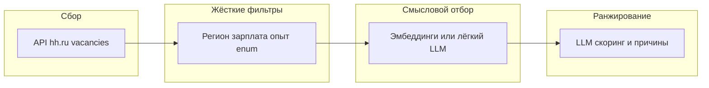
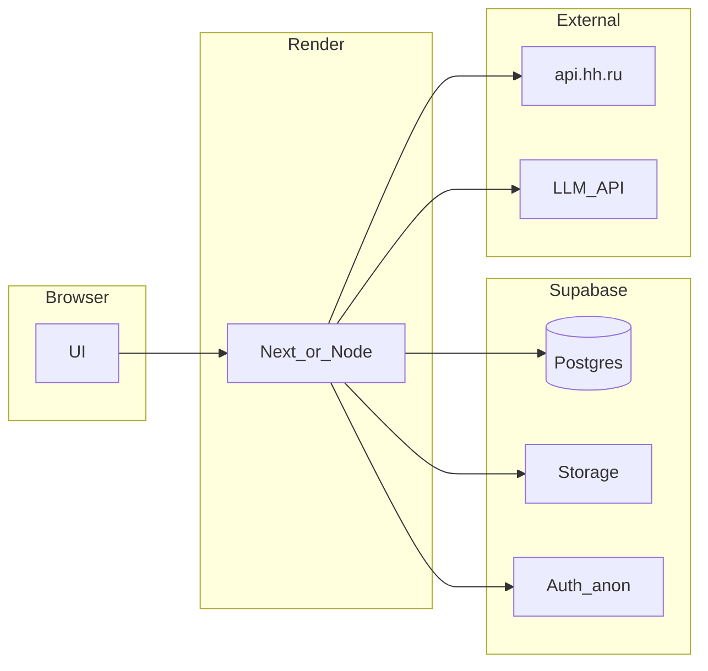

# Подбор и ранжирование вакансий hh.ru + LLM

## Ответ на вопрос про авторизацию

**Список вакансий и их описание можно получать без входа в аккаунт HeadHunter** через официальный API: метод поиска вакансий помечен в [документации hh](https://github.com/hhru/api) как доступный для анонимных запросов.

- **Обязательно:** заголовок `User-Agent` с контактом приложения (без него API отказывает).
- **Пагинация:** обычно до 100 вакансий на страницу, обход по `page` до исчерпания выдачи; учитывайте [лимиты и правила использования](https://dev.hh.ru/) (не ддосить, кэшировать где уместно).

**Креды не нужны**, если вам достаточно:

- поиска по ключевым словам и фильтрам;
- чтения карточек вакансий (описание, зарплата если указана, регион, опыт из справочника и т.д.).

**OAuth / токен понадобятся**, если нужны действия **от имени пользователя**: отклики, список «моих резюме» через API, скрытые поля, доступные только владельцу и т.п. Для вашего сценария «резюме как файл/текст у себя локально» токен hh **не обязателен**.

**Важно для автоматизации:** в описании метода поиска указано, что **без токена авторизации после первого запроса может потребоваться капча**; выдача также может отличаться от залогиненного пользователя. Имеет смысл закладывать обработку `403` с требованием капчи или использовать зарегистрированное приложение/сессию, если столкнётесь с этим на практике.

---

## Структура вакансии в API: где «жёсткие» поля, где «просто текст»

Идея «если Angular в отдельном поле — отбросить, если в произвольном тексте — разбирать нейросетью» **частично совпадает с реальностью API**, но с уточнением:

- **Отдельных полей уровня «обязательные условия» / «желательно» в модели вакансии для соискателя нет.** Как правило, весь свободный нарратив работодателя лежит в одном `**description`** (HTML). Дополнительно может быть `**branded_description**` (HTML бренд-шаблона).
- **Структурированные поля**, на которых можно строить **дешёвые правила без LLM** (и которые дублируются/дополняют поиск):
  - `**name`** — название вакансии (короткая строка).
  - `**key_skills**` — массив ключевых навыков (удобно для грубого матча/анти-матча по стеку; это не то же самое, что полный текст требований).
  - `**experience**` — уровень опыта из справочника (`experience` в `GET /dictionaries`).
  - `**employment_form**`, `**work_format**`, `**work_schedule_by_days**`, `**working_hours**` — занятость и формат (новые поля; часть старых `employment` / `schedule` помечена deprecated).
  - `**area**`, адрес/координаты (если есть), `**salary**` / `**salary_range**` — география и деньги, если работодатель указал.
  - `**professional_roles**` — профессиональные роли из справочника.
  - `**languages**`, `**driver_license_types**`, флаги вроде `**accept_handicapped**`, `**internship**`, `**night_shifts**`, и т.д.
- **Итог для стратегии фильтрации:** жёстко отсекать «только Angular» **надёжнее по `key_skills` + заголовку**, чем по вхождению в `description`; если сомнение — этап LLM/эмбеддингов по полному тексту.

**Короткая запись в выдаче поиска** vs **полная карточка:** в списке (`items`) объекты **укороченные** (см. [docs/vacancies.md](https://github.com/hhru/api/blob/master/docs/vacancies.md)); для полного `description`, `key_skills` и пр. нужен `**GET /vacancies/{vacancy_id}`** (схема `VacanciesVacancy` в OpenAPI).

**Уточнение области текстового поиска:** параметр `**text`** ищет в наборе полей, задаваемом `**search_field**`; допустимые значения — справочник `**vacancy_search_fields**` в `[GET /dictionaries](https://api.hh.ru/openapi/redoc#tag/Obshie-spravochniki/operation/get-dictionaries)`. Так можно, например, не размазывать запрос по всем полям, если это даст меньше мусора.

---

## Query-параметры `GET /vacancies` (поиск и отсев на стороне API)

Ниже — параметры из публичной спецификации (группировка логическая). Несколько значений там, где API это допускает, обычно передаются повтором ключа или в формате, описанном в доке.

**Пагинация и лимиты**

- `page`, `per_page` (макс. **100** на страницу).
- Ограничение глубины: суммарно не больше **2000** вакансий в срезе (`page` × размер страницы); при необходимости сужать запросы (`text`, `area`, даты и т.д.).

**Текст и исключения**

- `text` — поисковая строка; поддерживается [язык запросов hh.ru](https://hh.ru/article/1175).
- `search_field` — в каких полях искать (справочник `vacancy_search_fields`).
- `excluded_text` — **исключить вакансии, содержащие указанные слова** (через запятую) — грубый серверный анти-фильтр по тексту (всё ещё без понимания контекста).

**География**

- `area` — регион(ы), id из `[/areas](https://api.hh.ru/openapi/redoc#tag/Obshie-spravochniki/operation/get-areas)`.
- `metro` — ветка/станция, id из справочника метро.
- Прямоугольник по карте: `top_lat`, `bottom_lat`, `left_lng`, `right_lng` (все четыре обязательны вместе).
- Сортировка по расстоянию: `order_by` + `sort_point_lat`, `sort_point_lng` (см. справочник `vacancy_search_order`).

**Роль, индустрия, работодатель**

- `professional_role` — проф. роль (id из `/professional_roles`).
- `industry` — отрасль работодателя (id из `/industries`).
- `employer_id` — только вакансии выбранных работодателей.  
(Параметр `**excluded_employer_id`** есть в других методах выдачи, например в «похожих» вакансиях; в корневом `GET /vacancies` в текущей спецификации — **нет**, отсев работодателей на этом шаге — на своей стороне по полю `employer.id`.)

**Опыт, занятость, график**

- `experience` — id из справочника `experience` в `/dictionaries`.
- `employment_form` — тип занятости (`vacancy_search_employment_form`).
- `work_schedule_by_days`, `working_hours`, `work_format` — график и формат работы.
- Устаревшие, но ещё в API: `employment`, `schedule`, `part_time` (deprecated; заменены перечисленными выше / `label`).
- `accept_temporary` — только временная работа.
- `education` — уровень образования (ограниченный набор значений в описании параметра).
- `driver_license_types` — категории прав.

**Зарплата**

- `salary`, `currency` — «вилка близка к указанной» + пересчёт валют по курсам ЦБ (см. описание в OpenAPI).
- `salary_frequency`, `salary_mode`.
- `label` — метки вакансий из `vacancy_label` (в т.ч. аналог «только с зарплатой»: в доке указана замена для `only_with_salary` через `label=with_salary`).
- `only_with_salary` — deprecated.

**Свежесть публикации**

- `period` — число дней (для части методов указан max, например 30).
- `date_from`, `date_to` — интервал дат публикации (ISO 8601); не вместе с `period`.

**Прочее**

- `clusters`, `describe_arguments` — служебная аналитика выдачи.
- `no_magic` — отключить авто-преобразование текстового запроса в фильтры.
- `premium` — учитывать премиум-сортировку как на сайте.
- `responses_count_enabled` — добавить счётчики откликов.
- Плюс общие: `Host`, `Locale`, `HH-User-Agent` / требования к `User-Agent`.

---

## Почему задача в целом выполнима

Идея многоступенчатого конвейера снижает шум и стоимость LLM:

1. **Широкий забор данных** — запросы к `GET https://api.hh.ru/vacancies` с параметрами `text`, `area`, при необходимости проф. роли, опыт, зарплатные вилки (если API их поддерживает в вашем наборе фильтров — свериться с актуальной OpenAPI).
2. **Дешёвые жёсткие фильтры** — по уже структурированным полям ответа: регион, вилка зарплаты (если есть), уровень опыта из enum, тип занятости и т.д. Это отсекает очевидный мусор **без** нейросети.
3. **Проблема «Angular в тексте, а вакансия про React»** — наивные списки стоп-слов дают ложные срабатывания. Надёжнее:
  - **LLM** с явным промптом: «оцени соответствие стеку кандидата; упоминание технологии в другом контексте не считать дисквалификацией»; или
  - **эмбеддинги** (резюме + текст вакансии) + порог / rerank — дешевле на больших объёмах, но хуже на редких формулировках без дообучения.
4. **Финальный проход LLM** — только по сокращённому списку: скоринг совпадения, краткое обоснование, флаги «обязательный Team Lead / фулстек / география».
5. **Сортировка** — по числовому скору от модели (и при желании вторичным ключом).

---

## Практические ограничения

- Не все вакансии публикуют зарплату — фильтр по зарплате будет частичным.
- Текст описания может быть шаблонным или противоречивым — в промпте заложить «если неясно — не отбрасывать жёстко, снизить score».
- Стоимость и лимиты LLM: батчировать, сжимать вход (заголовок + ключевые требования + ваш профиль в сжатом виде), кэшировать результаты по `vacancy_id`.

---

## UX и бэкенд: предпочтения, поиск и кэш последней выдачи

**Два независимых ресурса на сервере** (в Postgres, строки с `**user_id` = `auth.uid()`**, доступ через **RLS**)

1. `**preferences`** — долгоживущие предпочтения (регион, базовый текст запроса, пороги и т.д.). Только **чтение/запись JSON**; при **«Сохранить предпочтения»** **нет** запросов к HeadHunter и **нет** вызовов LLM.
2. `**lastSearchCache`** — результат **последнего явного поиска** пользователя: отранжированный список вакансий (и сопутствующие данные для UI), **снимок параметров**, с которыми был выполнен этот прогон, и **время завершения** прогона.

**Два разных UI-потока**

- **Модалка / экран «Предпочтения»** — редактирование долгосрочных настроек + **«Сохранить»** → только обновление `preferences` на бэкенде.
- **Форма «Поиск»** — при открытии подставляет **копию** текущих `preferences` в поля черновика. Можно **временно** изменить, например, зарплату только для этого прогона; **предпочтения при этом не меняются**, пока пользователь снова не зайдёт в модалку предпочтений и не нажмёт «Сохранить» там.
- Кнопка **«Поиск»** (или аналог) — единственное действие, которое запускает цепочку **hh.ru → фильтры → LLM → ранжирование**. Итог записывается в `lastSearchCache` и заменяет предыдущий кэш.

**Поведение при F5 и срок жизни кэша**

- При загрузке страницы: **GET** `lastSearchCache`. Если запись **есть** и с момента **завершения** последнего поиска прошло **меньше 24 часов** — показываем **этот результат** без повторного обращения к hh.ru и без LLM (**никаких фоновых задач**).
- Если с последнего поиска прошло **≥ 24 часов** — блок результатов **пустой** (или заглушка «выполните поиск»); автоматически новый список **не** запрашивается. **Предпочтения** при этом по-прежнему подгружаются из `preferences` — форма поиска остаётся осмысленной для ручного запуска.
- Любой **новый** успешный поиск по кнопке **заменяет** кэш и **заново отсчитывает** 24 часа от времени завершения этого прогона.
- **Первый визит** без истории поиска: кэша нет — пустая выдача до первого явного «Поиск».

**Повторный запрос с теми же параметрами**

- Если пользователь нажимает «Поиск», а **канонический хэш/нормализованный снимок** параметров **совпадает** с уже сохранённым в `lastSearchCache` и кэш ещё **не протух** — **не** гонять повторно hh.ru и LLM: вернуть уже сохранённый результат (экономия и предсказуемость).

**Что не используем**

- `**localStorage`** для предпочтений и результатов не нужен при описанной серверной модели.

**Секреты**

- `**.env`**: ключи LLM и т.д. Предпочтения в `.env` не хранить.

**Опциональный seed в репозитории**

- Только для **первичного** заполнения `preferences`, если на бэкенде пусто; на поиск и кэш не влияет.

**Асинхронный поиск (не зависит от вкладки)**

- Кнопка «Поиск» создаёт запись **задачи** (`search_jobs`: pending / running / done / error) и **сразу** возвращает клиенту ответ (например `job_id`). Цепочка hh.ru → фильтры → LLM выполняется **на сервере**; закрытие вкладки **не отменяет** задачу.
- По завершении обновляются `lastSearchCache` и статус задачи. Клиент может опрашивать статус или открыть страницу позже и увидеть готовый кэш.

---

## Целевой стек и инфраструктура

**Рекомендуемая связка**

- **Приложение (UI + API routes / серверная логика):** деплой на **Render** (учётка уже есть). Переменные окружения в панели Render: строка Supabase, service role **только на сервере**, ключ LLM, и т.д.
- **Данные и файлы:** **Supabase** — **Postgres** (предпочтения, кэш последнего поиска, статусы задач, метаданные резюме), **Auth**, **Storage** (PDF резюме). Деплой на Render **не затрагивает** базу и файлы в Supabase.

**Авторизация v1: Anonymous sign-in**

- При первом визите — **Supabase Anonymous Auth** (без пароля и без «фейкового» логина). Все строки в БД и объекты в Storage привязаны к `**auth.uid()`**.
- Позже для друзей: привязка **email / OAuth** к тому же аккаунту Supabase — модель данных **не меняется**.
- **RLS** в Postgres и политики Storage: пользователь видит и меняет только **свои** строки и файлы.

**Резюме (PDF)**

- Загрузка через **Uploader** в **Supabase Storage** по пути вроде `{user_id}/resume.pdf` (или с версией в имени). В Postgres — метаданные и при необходимости **извлечённый текст** для LLM (бинарник PDF в таблицу не класть по умолчанию).
- Если файл для `user_id` уже есть — UI **не настаивает** на повторной загрузке; опция «заменить файл» доступна.

**Бесплатный tier и уборка данных**

- Лимиты Supabase (место, трафик) и Render (сон инстанса, cold start) — **некритичны** для личного сценария; при нехватке места — **ручная** чистка Storage и неактивных строк в дашборде.
- Правила авто-удаления неактивных пользователей / старых PDF — **отложено** на этап роста проекта.

---

## HeadHunter: объём запросов и аккуратность

- **Поиск** `GET /vacancies`: до **100** записей на страницу, глубина выдачи до **1000** — для сотен/тысячи вакансий нужно **несколько запросов с разным `page`**, аккумулировать на сервере.
- **Тяжёлая часть** — массовое получение **полных карточек** `GET /vacancies/{id}` (описание, `key_skills`): нужны **ограничение параллелизма**, паузы, уважение к правилам API; по возможности **сужать список** правилами до LLM.
- Кэширование ответов по `vacancy_id` в своей БД — по желанию, чтобы не дёргать hh повторно.

---

## Репозиторий

Сейчас рабочая папка проекта пустая — реализации кода ещё нет. После утверждения плана: **Next.js (или Node) на Render**, **Supabase** (схема + RLS + anonymous auth + Storage), модуль hh.ru, LLM, **UI**: предпочтения (save only), поиск со стартом фоновой задачи, отображение кэша при F5, загрузка PDF.

Опционально для разработки: скрипт или SQL для начального seed `preferences` без UI.