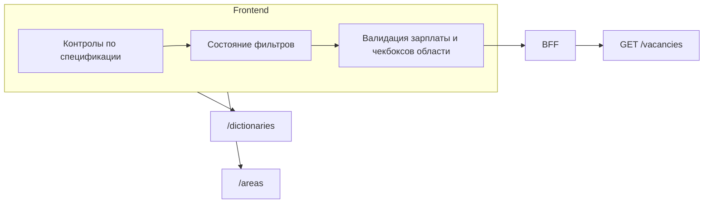

# План: фильтры HeadHunter API (зафиксированный UI)

## Эндпоинт и общие правила

- **Поиск:** `GET https://api.hh.ru/vacancies` ([OpenAPI](https://api.hh.ru/openapi/specification/public), `get-vacancies`).
- **User-Agent:** осмысленный заголовок (требование HH).
- **Пагинация:** `page` с 0, `per_page` ≤ 100; глубина выдачи ~2000.
- **Массивы в query:** повторяющиеся параметры (`area=1&area=2`, несколько `search_field`, несколько `label`, и т.д.).
- **Не используем в UI:** `metro`, `period` / `date_from` / `date_to`, `order_by` (ранжирование делает нейросеть позже), `professional_role`, `industry`, `employer_id`, `education`, `work_schedule_by_days`, `working_hours`, `excluded_text` (пока), гео-прямоугольник.

---

## Спецификация UI → параметры API

### 1. Текст поиска

- **Контрол:** однострочный `input`, по умолчанию пусто.
- **API:** `text` — передавать только если строка непустая (после trim).

### 2. Где искать (область текста)

- **Контрол:** три чекбокса, соответствующие `vacancy_search_fields` из `/dictionaries`:
  - в названии вакансии → `name`
  - в названии компании → `company_name`
  - в описании → `description`
- **Поведение:** по умолчанию **все три включены** (эквивалентно «искать везде по тексту»; можно не слать `search_field` вообще, либо слать все три — поведение как у HH по умолчанию).
- **Правило:** если пользователь снимает чекбоксы так, что **остаётся 0 включённых**, автоматически снова **включить все три** (нельзя отправить поиск «нигде не искать»).
- **API:** для каждого включённого — отдельный `search_field=<id>`. Если все три включены — опционально опустить параметр для краткости.

### 3. Регион

- **Контрол:** отдельный **компонент мультивыбора регионов** (см. [§3.1](#31-компонент-мультиселект-регионов-как-на-hh--пресеты)), по умолчанию **пусто** = не передавать `area`.
- **API:** `area=<id>` для каждого выбранного; пустой выбор → не передавать `area`.
- **Справочник:** `GET https://api.hh.ru/areas` — иерархическое дерево + **плоский индекс** всех узлов (`id`, `name`, опционально `parentId`) для поиска.
- **Почему «Польша» / «Португалия» могли не находиться:** в API у узлов **русские** названия (**Польша** `id=74`, **Португалия** `id=241`). Они лежат внутри **«Другие регионы»** (`id=1001`). Поиск по **Poland** / **Portugal** без маппинга **не сработает** — опционально позже: слой **en→ru** или подсказки.
- **Про полноту справочника:** у HH **нет** всех стран ООН; под **«Другие регионы»** ~**156** узлов первого уровня; часть стран **отсутствует** (пример: Мозамбик).
- **Масштаб:** **9 корней**, **~88** субъектов РФ, **~15k+** узлов всего; **города** — через поиск по индексу.
- **Отдельного API «только страны» нет** — только `/areas`.
- **Метро:** не делаем.

#### 3.1 Компонент: мультиселект регионов (как на HH + пресеты)

**Цель:** один компонент — **чипы/кнопки пресетов** (всегда видны) + **объединённый список стран с чекбоксами** + **поиск** (как у HH для произвольных узлов).

**Состояние (два уровня):**

1. **Активные чипы** — множество включённых пресетов/групп (EU, EFTA, Африка, «Австралия и Новая Зеландия», …). Чип **кликабелен**: включён — **визуально подсвечен** (selected / filled); выключен — нейтральный. Можно **несколько** активных одновременно (напр. **AU+NZ** + **Африка**).
2. **Пул кандидатов** — **объединение** (`union`) всех `area` id из **активных** чипов (по определениям пресетов из констант). При **включении** чипа его id **добавляются** в пул; при **выключении** — id этого пресета **убираются из пула** (если тот же id не даёт другой активный чип — см. пересечения: тогда id остаётся в пуле).
3. **Итоговый фильтр для API** — подмножество пула: **`Set` отмеченных чекбоксами** id. При **первом появлении** id в пуле (чип только что включили) — по умолчанию **все новые id сразу включены** (галочки стоят). Пользователь **снимает** ненужные страны в объединённом списке — они **исчезают из запроса**, но чип может оставаться **подсвеченным** (**неполный** выбор по группе): для UX допустимо состояние чипа **indeterminate** (частично выбрано) или оставить чип «вкл» пока в пуле есть хотя бы один id от этого пресета — зафиксировать в реализации.
4. **Снятие чипа целиком** — удалить из пула все id, принадлежащие **только** этому пресету; из итогового `Set` убрать эти id; если id пересекается с другим активным чипом — **не** удалять из `Set` (остаётся выбранным).

**Блок UI «Регионы» (порядок сверху вниз):**

- **Ряд 1 — чипы/кнопки:** все быстрые пресеты и одиночные страны (**США**, **Канада**, **UK**, **IE**) как **отдельные чипы**; опционально чип **«Вся Россия»** или вход в блок субъектов.
- **Ряд 2 — объединённый список:** если активен **хотя бы один** чип (или пул не пуст) — показать **единый скроллируемый список** всех стран/узлов **первого уровня** из пула (название + чекбокс), **по алфавиту** или сгруппировано по пресету-источнику (опционально). Пример: выбраны **«Австралия и Новая Зеландия»** и **«Африка»** — в списке **все африканские** страны из константы **плюс** AU и NZ, каждая строка **переключается** независимо.
- **Поиск** — как раньше: находит узлы по индексу; выбранные через поиск можно **добавлять** в итоговый `Set`; узлы **вне** текущего пула чипов — показывать в секции **«Добавлено по поиску»** в том же списке или отдельным блоком чипов «вручную», чтобы **не терялись** при фильтрации строки поиска.

**Поведение при поиске (критично):**

- **Список результатов** показывает только узлы, **подходящие под строку поиска** (подстрока без регистра по русскому `name`, опционально — по латинице после маппинга).
- **Уже выбранные** id **остаются в выборе** независимо от того, попадают ли они в текущую выдачу поиска.
- **UI:** как минимум одна из схем (любая читаемая):
  - **Чипы / блок «Выбрано»** над списком — всегда показывает текущий выбор с возможностью снять; список ниже — только результаты поиска **плюс** опционально вставлять выбранные в начало с отмеченным чекбоксом; или
  - Выбранные **закреплены сверху** списка, ниже — результаты поиска без дублирования.

**Панель по умолчанию (без ввода в поиск) — быстрые пресеты и РФ:**

Не дублировать весь мир в скролле; вместо этого:

1. **Пресеты как чипы** (см. двухуровневую модель выше): каждый пресет задаёт **набор** `id` в HH; активный чип **вносит** эти id в **пул** → они попадают в **объединённый список** с чекбоксами. Прямой «вслепую» сброс в API без списка **не** требуется — пользователь **может** отредактировать состав перед поиском вакансий.

   **Определения наборов id** (без изменения географической логики):
  - **«EU» (ЕС):** только **члены ЕС** (актуальный список; **UK не входит**); пересечение с `/areas`.
  - **«EFTA»:** **Исландия, Лихтенштейн, Норвегия, Швейцария**; пересечение с `/areas`.
  - **«Балканы»:** только страны **Балканского региона, которые не входят в ЕС** (на момент состава константы: **без Хорватии, Словении, Болгарии, Румынии, Греции** и прочих **членов ЕС** на Балканах / в прилегающей зоне). В набор попадают, например, **кандидаты и потенциальные «Западные Балканы»** (Сербия, Босния и Герцеговина, Черногория, Северная Македония, Албания и т.п. — **точный список по именам из HH**). **Сербия** из **отдельных стран не выводится** — только через этот пресет (или поиск).
  - **«Кавказские страны»:** один пресет — **Грузия, Армения, Азербайджан** (по одному/нескольким `area` id из HH на страну). **Турция сюда не входит** (географически/продуктово — не «кавказская тройка»).
  - **«Ближний Восток»** (рабочее имя в UI): **Турция** + **ОАЭ** + **Израиль** + **другие «развитые» / целевые** страны региона по согласованному списку (например **Саудовская Аравия, Катар, Кувейт, Бахрейн, Оман** — только те, что **есть в `/areas`**). Состав и подпись кнопки зафиксировать в константе и **tooltip** («что входит»). Эти страны **не дублировать** в пресете **«Азия»**.
  - **«Центральная и Южная Америка»:** страны **Центральной и Южной Америки** по константе (ISO/список имён на русском из HH); **без США и без Канады** (они — в блоке отдельных стран). Пересечение с `/areas`.
  - **«Африка»:** все страны **Африки**, для которых есть узел в `/areas` (в пределах «Другие регионы» и т.д.) — список собирается скриптом по классификации **Africa** или поддерживается явным массивом id.
  - **«Япония и Южная Корея»:** один чип — в пул попадают **оба** id; в объединённом списке пользователь может **снять** одну из стран. **Отдельных** чипов «только Япония» / «только Корея» нет (одна страна — **поиск**).
  - **«Австралия и Новая Зеландия»:** один чип — оба id в пуле; дальше — чекбоксы в общем списке. Отдельных чипов AU / NZ нет.
  - **«Азия»:** страны **Азии** в `/areas`, **без дублирования** с другими пресетами:
    - **не включать** **Россию** (блок РФ / `113`);
    - **не включать** страны пресета **«Кавказские страны»** (GE, AM, AZ);
    - **не включать** страны пресета **«Ближний Восток»** (TR, AE, IL и пр. из его константы);
    - **не включать** id пресета **«Япония и Южная Корея»**;
    - **Австралия и Новая Зеландия** в **«Азию»** не входят (отдельный пресет **«Австралия и Новая Зеландия»**).
    Остальная Азия (Китай, Индия, Вьетнам, Сингапур, …) — в **«Азия»**. Опционально **исключить из «Азии» страны — члены ЕС** (напр. **Кипр**), чтобы не пересекаться с **EU**.

2. **Отдельные страны** — тоже **чипы** (один id на чип): **США**, **Канада**, **Великобритания**, **Ирландия**. При активации чипа **одна** строка в объединённом списке (или сразу в `Set` как пул из одного id — эквивалентно). Остальное — пресет-чипы или поиск.

3. **Россия:** **отдельная секция** (чтобы не смешивать ~88 строк с «мировым» списком от чипов): скролл **субъектов РФ** с чекбоксами + опционально **«Вся Россия»** (`113`). Отмеченные id **вливаются в тот же итоговый `Set`** для `area=`, что и страны из объединённого списка выше.

4. **Остальное** — через **поиск** по полному индексу (как на HH).

**Дубли id:** в **пуле** и в **итоговом `Set`** — уникальные значения; пересечение пресетов (редко) не даёт дублей в UI.

**Технически:** `areaPresets.ts` (или JSON) — **`euAreaIds`**, **`eftaAreaIds`**, **`balkansNonEuAreaIds`**, **`caucasusAreaIds`**, **`middleEastAreaIds`**, **`latinAmericaAreaIds`**, **`africaAreaIds`**, **`japanKoreaAreaIds`** (JP+KR), **`anzAreaIds`** (AU+NZ), **`asiaAreaIds`** (континент минус: РФ, Кавказ, Ближний Восток, `japanKoreaAreaIds`, AU/NZ, опционально EU в Азии). Карта **одиночных стран**: USA, CA, UK, IE. Сборка из `/areas` + дата версии.

**Важно:** в **API** уходят только **`area` id из итогового `Set`** (после чекбоксов). Чипы и пул — **чисто UI**. Несколько активных чипов — **union** в пуле, затем пользователь **сужает** выбор чекбоксами.

### 4. Профиль / отрасль / работодатель

- **В UI не выводим** (`professional_role`, `industry`, `employer_id`). При необходимости позже — отдельный ввод вручную.

### 5. Образование

- **В UI не выводим** (`education` не передаём).

### 6. Тип занятости (`employment_form`)

- **Контрол:** список из **четырёх** строк: слева чекбокс, справа подпись как в справочнике `vacancy_search_employment_form` (`/dictionaries`).
- **Поведение:** если **ни один** не отмечен — параметр **не передаём** (фильтр не участвует).
- **Исключения из продуктовых требований:** в UI **не выводить** стажировку как отдельный режим; **не выводить** то, что вы относите к «ГПХ и совместительству» — после сверки с актуальным `/dictionaries` зафиксировать, какие именно `id` скрыть (часто спорная зона: `PART` = частичная занятость). Задача [employment-form-clarify](#employment-form-clarify).
- **Не выводим:** график по дням (`work_schedule_by_days`), рабочие часы (`working_hours`).

### 7. Опыт работы

- **Контрол:** **радиокнопки**, первая опция: **«Не имеет значения»** (ничего не отправляем в `experience`).
- **Остальные:** значения `id` из `experience` в `/dictionaries` (`noExperience`, `between1And3`, `between3And6`, `moreThan6`) — показывать подписи с API.
- **API:** не более одного `experience` при выборе конкретного варианта.

### 8. Формат работы

- **Контрол:** чекбоксы по `work_format` из `/dictionaries`: `ON_SITE`, `REMOTE`, `HYBRID`, `FIELD_WORK` (подписи с API).
- **Поведение:** по умолчанию **ничего не выбрано** → параметр **не передаём**. Один или несколько отмеченных → несколько `work_format=...`.

### 9. Метки вакансий (`label`)

- **Контрол:** чекбоксы, по умолчанию **все выключены** (disabled в смысле «фильтр выкл», не HTML `disabled`).
- **Вывести (id из `vacancy_label`):**
  - `not_from_agency` — без кадровых агентств
  - `accept_handicapped` — доступные для людей с инвалидностью
  - `with_address` — только с адресом
  - `low_performance` — меньше 10 откликов
  - `accept_kids` — с 14 лет
  - `accredited_it` — аккредитованные ИТ-компании
  - `accept_teens` — с 16 лет
- **API:** для каждого включённого — `label=<id>`. Остальные метки из справочника при желании можно добавить позже отдельным списком.

### 10. Зарплата и валюта

- **Контрол:** одна строка: числовое поле зарплаты, по умолчанию пусто.
- **Валюта:** селектор **скрыт**, пока поле зарплаты пустое. Как только введено число (или ненулевое значение — зафиксировать в реализации) — показать селектор валюты; **без предзаполнения** (не подставлять RUR по умолчанию в UI).
- **Валидация при отправке поиска:** если зарплата задана (после trim/парсинга) — **обязательно** выбрана валюта (`currency` = `code` из `/dictionaries` → `currency`). Иначе ошибка формы.
- **Очистка:** если пользователь **очистил** зарплату — скрыть селектор валюты, сбросить выбранную валюту, форма снова валидна **без** зарплатного фильтра.
- **API:** `salary` + `currency` только вместе; при необходимости уточнить, нужен ли дополнительно `label=with_salary` — в OpenAPI «только с зарплатой» связано с меткой; если вводите число, обычно достаточно `salary` (HH подбирает вилку). При расхождении с выдачей сайта — добавить `label=with_salary`.

### 11. Дата публикации

- **Не используем** — смотрим все объявления в рамках остальных фильтров.

### 12. Сортировка

- **Не важно для UI** — можно не передавать `order_by` (дефолт API) или зафиксировать одно значение на бэке; скоринг делает нейросеть.

---

## Архитектура

Рекомендуется **BFF** (свой бэкенд): `User-Agent`, кэш справочников, обход CORS.

---

## Чеклист реализации

1. Модель состояния фильтров и функция **маппинга в query** (включая «не слать пустое»).
2. Загрузка и кэш **`/dictionaries`**, **`/areas`**; индекс; константы пресетов (в т.ч. **`japanKoreaAreaIds`**, **`anzAreaIds`**) и одиночные **США, Канада, UK, IE**.
3. **Компонент мультиселекта регионов** (§3.1): поиск + чекбоксы; выбранные не теряются; пресеты add/remove по наборам id.
4. Остальные контролы; логика **трёх чекбоксов** области текста; **зарплата ↔ валюта**.
5. **Сверка четырёх типов занятости** с исключениями по актуальным `id`.
6. Снапшоты query-string (EU, EFTA, региональные пресеты → много `area=`; дубли id в Set не попадают).

---

## Памятка: как не терять план

Этот файл — источник правды по UI. При новом чате можно сослаться на путь плана в `.cursor/plans/` или скопировать раздел «Спецификация UI» в репозиторий, когда появится код.